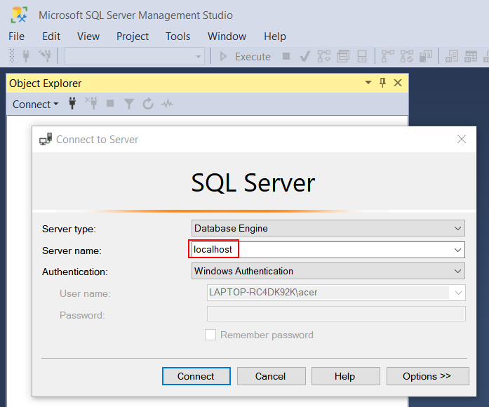
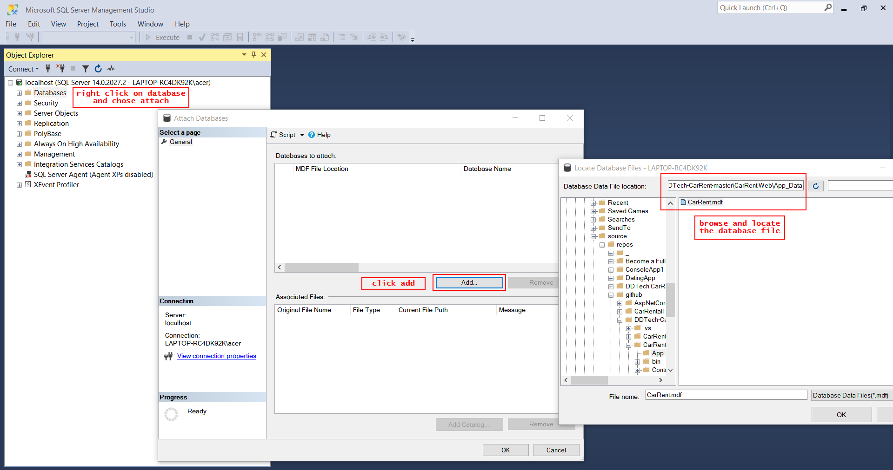

# DDTech-CarRent

How to attach the Lodatabase:

Make sure you have installed SQL Server Express LocalDB.
Open Microsoft SQL Server Management Studio and input your LocalDB server name.

Attach the database file.

